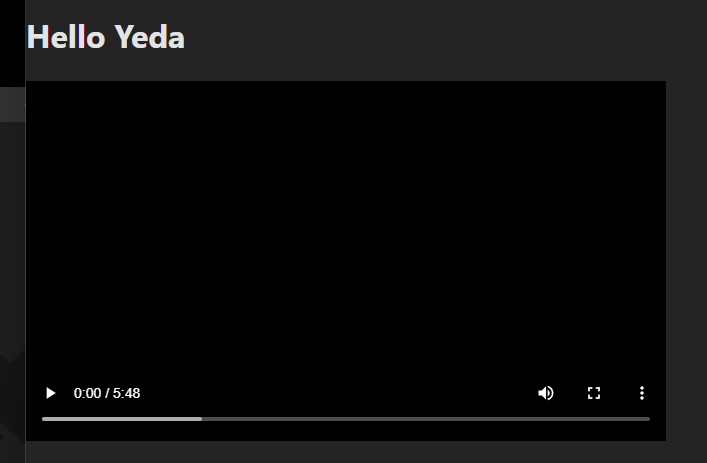

# HLS Video Player

Follow the installation guide below to start.

I recommend using [pnpm](https://pnpm.io/).

Clone, install dependencies and run the app with:

```bash
git clone https://github.com/burgil/example-hls-video-player
cd example-hls-video-player
pnpm install
pnpm approve-builds
pnpm dev
```

Then open the app: <http://localhost:5173/>

## Patch log

v1.0:


