# HLS Video Player

Follow the installation guide below to start.

I recommend using [pnpm](https://pnpm.io/).

Clone, install dependencies and run the app with:

```bash
git clone https://github.com/burgil/example-hls-video-player
cd example-hls-video-player
pnpm install
pnpm approve-builds
pnpm dev
```

Then open the app: <http://localhost:5173/>

## Patch log

v1: Got something basic

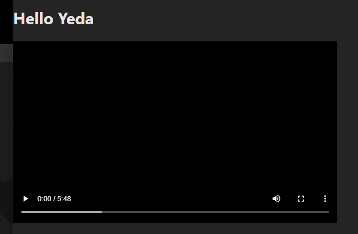

v2: Getting there

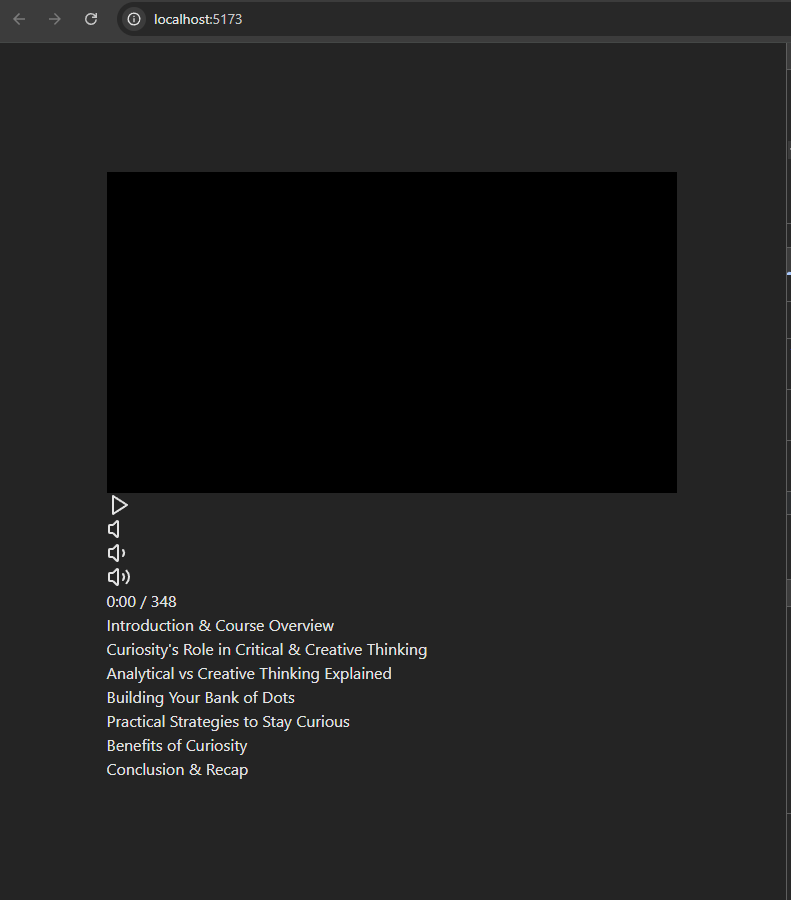

v3: Parsed the time

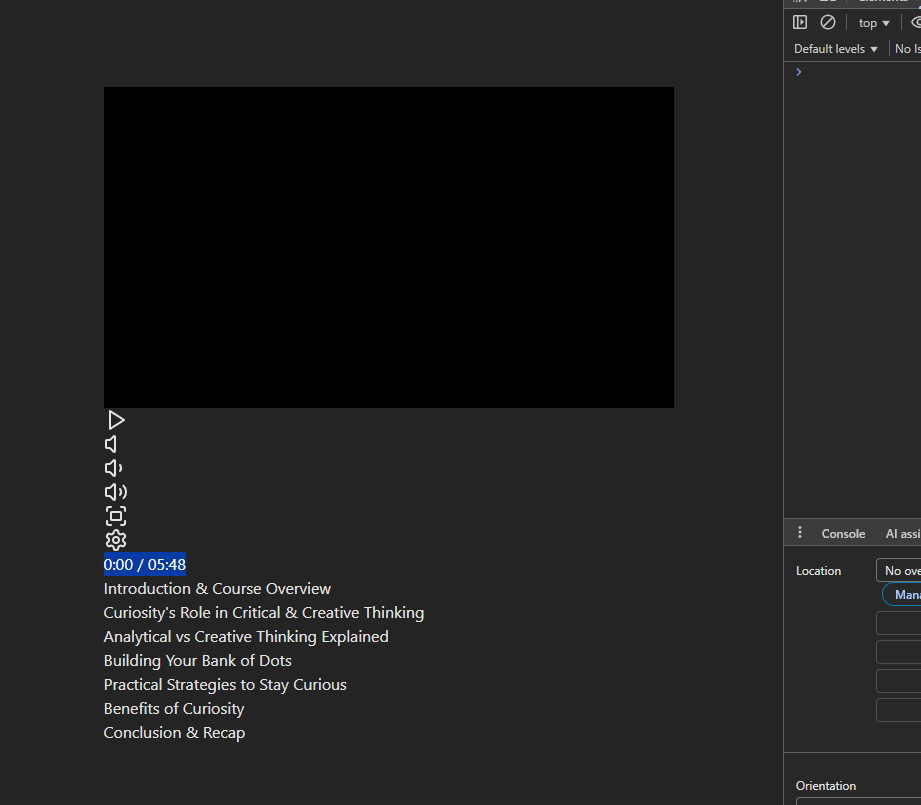

v4: Working on the video controls

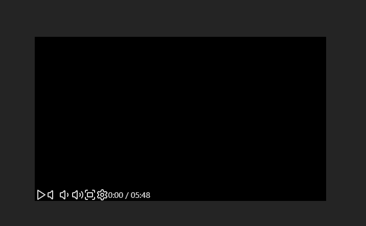

v5: Controls almost done

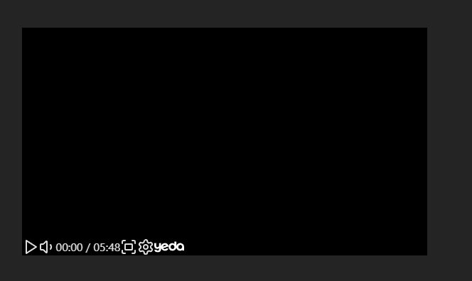

v6: The timer works now!

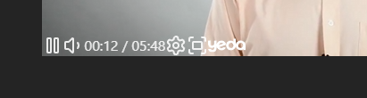

v7: Better controls design and handling

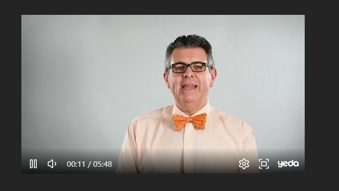

v8: Fullscreen support!

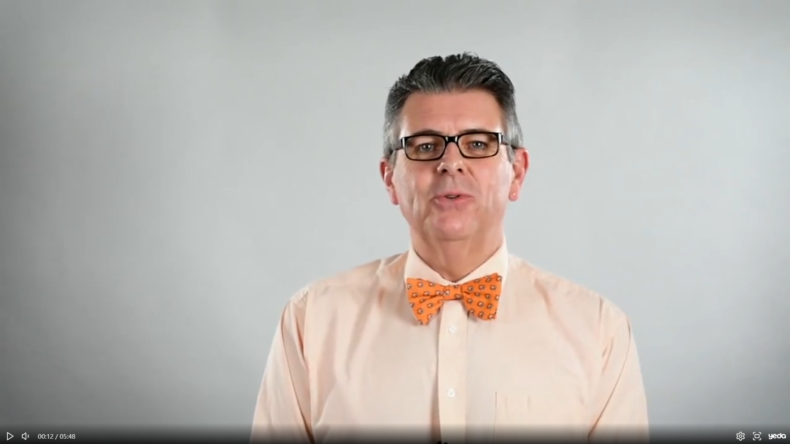

v9: Timeline looks good! (Still not hoverable xD)

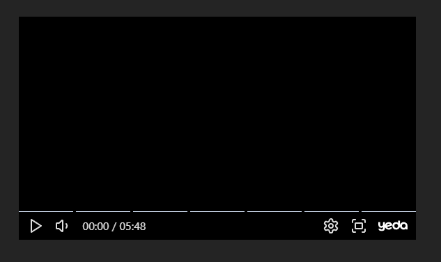

v10: Rounded edges loosk good!

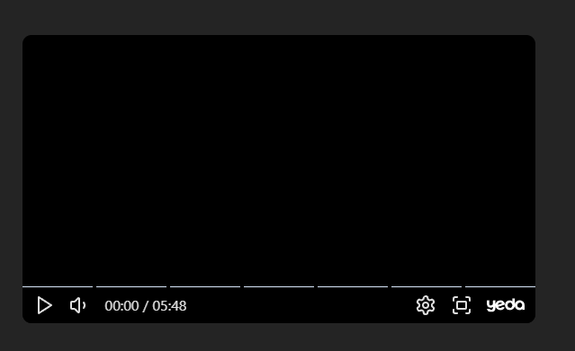

v11: Chapters are showing up

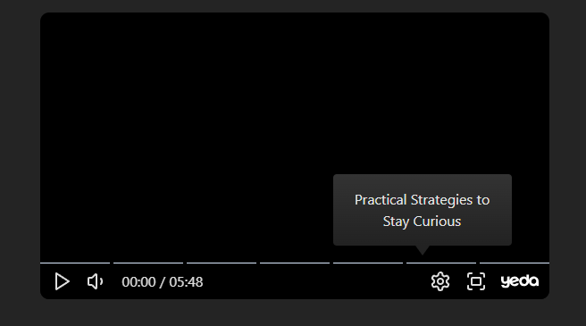

v12: Almost done

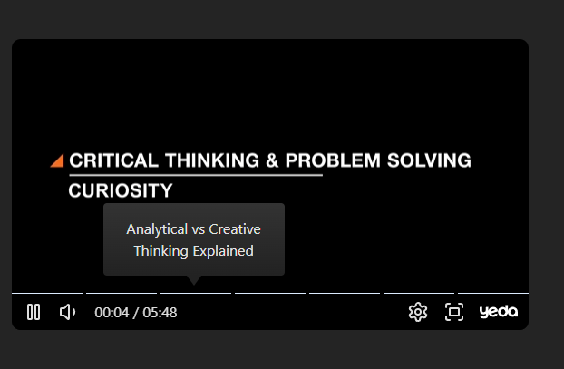

v13: Final touches

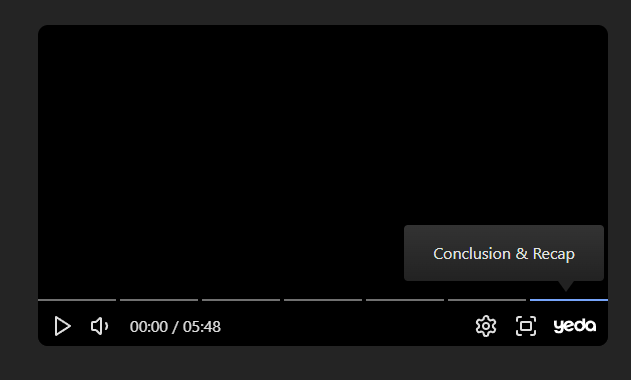

v14: Made the chapters follow the mouse & show current hover time + detect click time

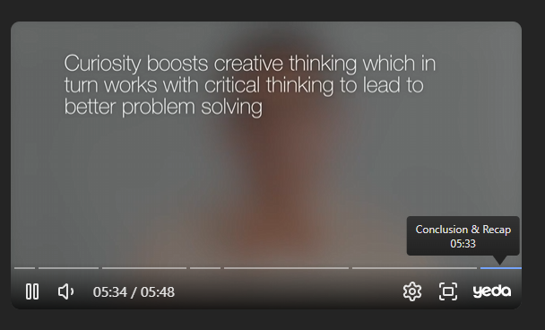

v15: Playhead is working nice

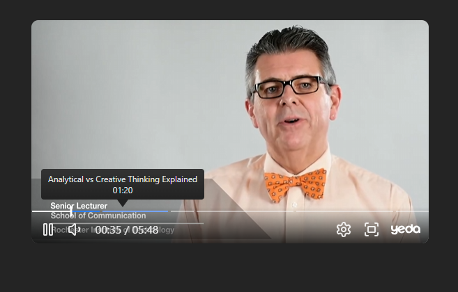

v16: Finished! Quality controls + error handling

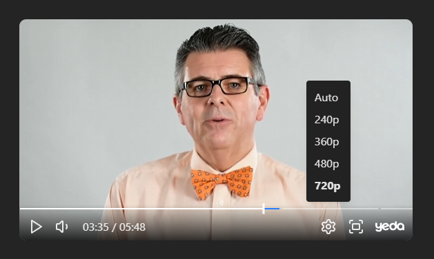
